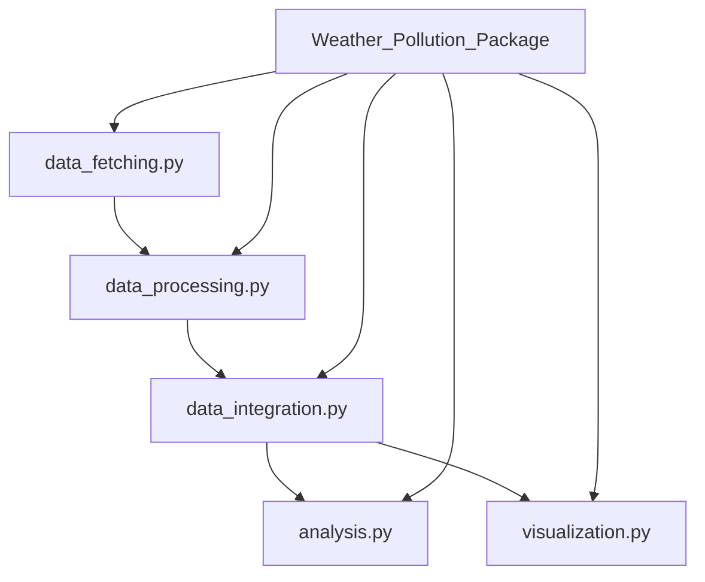
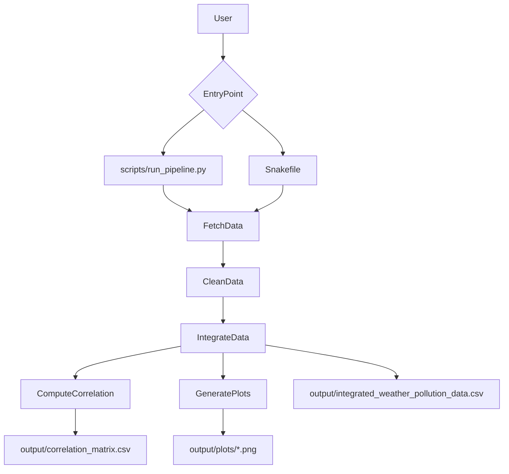

# Pollutant-Weather Analysis in Chicago

[](https://doi.org/10.5281/zenodo.14373781)
[](https://opensource.org/licenses/MIT)
[](https://www.python.org/downloads/)

Reproducible analysis of how weather conditions (temperature, humidity, wind speed) relate to nitrogen dioxide (NO2) levels in Chicago.

## What This Repository Does
- Fetches weather observations from the City of Chicago API.
- Fetches NO2 data from the EPA AQS API.
- Cleans and aligns both datasets at daily granularity.
- Produces integrated analysis outputs and visualizations.
- Runs either as a Python script or a Snakemake workflow.

## Quick Start (Run in 3 Steps)
1. Install dependencies:
   ```bash
   python3 -m venv venv
   source venv/bin/activate
   pip install -r requirements.txt
   ```
2. Set EPA credentials:
   ```bash
   export EPA_API_EMAIL="your_email@example.com"
   export EPA_API_KEY="your_api_key"
   ```
3. Run pipeline:
   ```bash
   python3 scripts/run_pipeline.py
   ```
   or
   ```bash
   snakemake --cores 4
   ```

## Architecture

### Module Architecture


### Execution Flow


## GitHub-Native Interactive Section
Use the expandable sections below for a guided tour directly on GitHub.

<details>
<summary><strong>Pipeline Walkthrough</strong></summary>

1. `fetch_weather_data()` and `fetch_pollutant_data()` retrieve raw API data.
2. `clean_weather_data()` and `clean_pollutant_data()` standardize columns and quality.
3. `integrate_datasets()` aligns weather and pollutant records by date.
4. `compute_correlation()` creates the correlation matrix.
5. Visualization utilities export trend and relationship plots.

</details>

<details>
<summary><strong>Expected Outputs</strong></summary>

- `output/integrated_weather_pollution_data.csv`
- `output/correlation_matrix.csv`
- `output/plots/` PNG figures

</details>

<details>
<summary><strong>Troubleshooting</strong></summary>

- Missing EPA credentials: export `EPA_API_EMAIL` and `EPA_API_KEY`.
- Import errors: reactivate your virtual environment and reinstall requirements.
- Empty outputs: verify API access and rerun pipeline command.

</details>

## Hybrid Artifact Strategy
This repository tracks **source + curated showcase artifacts**, while excluding bulky/generated runtime files.

- Curated artifacts belong in `output/showcase/`.
- Full runtime-generated outputs in `output/` are excluded by `.gitignore`.
- Temporary CSVs under `data/` are excluded (except `data/.gitkeep`).

Recommended curated set for presentation:
- 1 integrated sample dataset (small CSV)
- 2-3 representative plots (for findings overview)

## Repository Structure
```text
Pollutant_Analysis_IS477/
├── Weather_Pollution_Package/
│   ├── data_fetching.py
│   ├── data_processing.py
│   ├── data_integration.py
│   ├── analysis.py
│   ├── visualization.py
│   └── __init__.py
├── scripts/run_pipeline.py
├── Snakefile
├── requirements.txt
├── data_dictionary.md
├── metadata.json
├── output/showcase/
├── README.md
└── LICENSE
```

## Documentation
- Data dictionary: [`data_dictionary.md`](data_dictionary.md)
- Metadata record: [`metadata.json`](metadata.json)
- Archived DOI release: [Zenodo](https://doi.org/10.5281/zenodo.14373781)

## Pre-Push Checklist
- [ ] `pip install -r requirements.txt` succeeds
- [ ] EPA credentials are set in environment (not committed)
- [ ] Pipeline runs from script or Snakemake
- [ ] README links and Mermaid diagrams render on GitHub
- [ ] `venv/`, caches, and generated noise are not tracked
- [ ] Curated showcase artifacts in `output/showcase/` are intentional

## License
MIT License. See [`LICENSE`](LICENSE).
