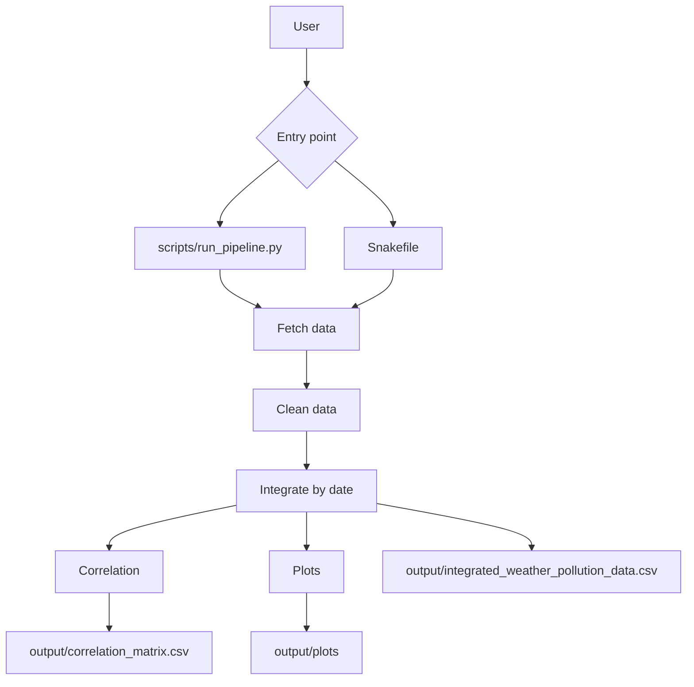

<div align="center">

# Pollutant–Weather Analysis in Chicago

[](https://doi.org/10.5281/zenodo.14373781)
[](https://opensource.org/licenses/MIT)
[](https://www.python.org/downloads/)


**TL;DR — One sentence:** A reproducible data pipeline that joins Chicago weather with EPA nitrogen dioxide (NO₂) data to show how temperature, humidity, and wind relate to air pollution — with clean datasets, correlations, and plots you can regenerate in one command.

**Why it matters:** Urban air quality isn't only about emissions. Weather shapes how pollution builds up or clears. Understanding those relationships helps make environmental data useful for analysis, teaching, and city-scale storytelling.

</div>

---

## What this is (in plain English)

This project answers a concrete question:

> When weather changes in Chicago, how does NO₂ pollution move with it?

It does that by building a **full pipeline**, not a one-off notebook:

1. **Fetch** weather from the City of Chicago API and NO₂ from the EPA AQS API  
2. **Clean** and align both sources to a shared daily timeline  
3. **Integrate** into one analysis-ready dataset  
4. **Analyze** correlations and export publication-style charts  

Run it as a Python script *or* a Snakemake workflow. Outputs land in `output/` (with curated showcase samples kept for portfolio viewing).

Archived release: [DOI 10.5281/zenodo.14373781](https://doi.org/10.5281/zenodo.14373781)

---

## Why it's interesting / significant

| | |
|---|---|
| **Real public data** | City weather + EPA AQS — the same kinds of sources used in serious environmental work |
| **End-to-end engineering** | Ingest → clean → join → analyze → visualize, not just a chart dump |
| **Reproducibility** | Script entrypoint *and* Snakemake; documented data dictionary + Zenodo DOI |
| **Clear findings** | Humidity inversely related to NO₂; low wind ↔ higher NO₂ buildup; temperature effects look seasonal / non-linear |
| **Reusable pattern** | Swap pollutant or city and keep the same architecture |

**Skills on display:** Python data workflows, API integration, reproducible pipelines, statistical exploration, technical documentation.

---

## Key takeaways from the analysis

- **Humidity** tends to move opposite NO₂ concentration  
- **Lower wind speeds** align with higher NO₂ accumulation  
- **Temperature** effects look more seasonal and non-linear than a simple straight-line story  
- The package layout is intentionally reusable for other pollutants or cities  

---

## Quick start (3 steps)

```bash
python3 -m venv venv
source venv/bin/activate
pip install -r requirements.txt
```

```bash
export EPA_API_EMAIL="your_email@example.com"
export EPA_API_KEY="your_api_key"
```

```bash
python3 scripts/run_pipeline.py
# or: snakemake --cores 4
```

---

## How the pipeline works



**Module map:** `data_fetching` → `data_processing` → `data_integration` → `analysis` + `visualization` (all under `Weather_Pollution_Package/`).

<details>
<summary><strong>Step-by-step walkthrough</strong></summary>

1. `fetch_weather_data()` / `fetch_pollutant_data()` — pull raw API data  
2. `clean_weather_data()` / `clean_pollutant_data()` — standardize columns and quality  
3. `integrate_datasets()` — align by date  
4. `compute_correlation()` — correlation matrix  
5. Visualization helpers — trend and relationship PNGs  

</details>

<details>
<summary><strong>Expected outputs</strong></summary>

- `output/integrated_weather_pollution_data.csv`  
- `output/correlation_matrix.csv`  
- `output/plots/` PNG figures  
- Curated samples for the portfolio live in `output/showcase/`  

</details>

<details>
<summary><strong>Troubleshooting</strong></summary>

- Missing EPA credentials → export `EPA_API_EMAIL` and `EPA_API_KEY`  
- Import errors → reactivate the venv and reinstall `requirements.txt`  
- Empty outputs → check API access, then rerun  

</details>

---

## Repository structure

```text
Pollutant_Analysis_IS477/
├── Weather_Pollution_Package/   # fetch, clean, integrate, analyze, plot
├── scripts/run_pipeline.py
├── Snakefile
├── requirements.txt
├── data_dictionary.md
├── metadata.json
├── output/showcase/             # curated portfolio artifacts
├── README.md
└── LICENSE
```

**Note:** Runtime-generated bulk under `output/` and temp CSVs under `data/` are gitignored; showcase samples are intentional.

---

## Docs

- [`data_dictionary.md`](data_dictionary.md) — field definitions  
- [`metadata.json`](metadata.json) — project metadata  
- [Zenodo archive](https://doi.org/10.5281/zenodo.14373781)  

---

## License

MIT — see [`LICENSE`](LICENSE).
